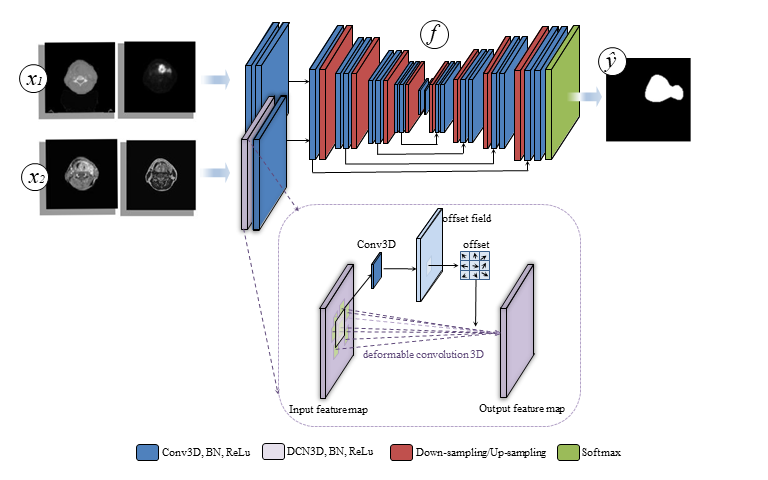

# Deformable Convolution Network(DCN) for head-and-neck tumor segmentation with PET/CT and MRI
3D deformable convolution network(DCN) for head and neck tumor segmentation

Code for ESTRO21 hight poster : 
```End-to-end head & neck tumor auto-segmentation using CT/PET and MRI without deformable registration```




The experiments was conducted using 'nnUNet' as a training pipeline and baseline. Please install nnUNet first and copy the DCN codes from this repo to your nnUNet folder.

To train, please run trainer 'nnUNetTrainerV2_200_DCN'. 

The image modality order should be: CT, PET, T1 and T2. The first two input channels will go through a normal convolution block while the last two channels(T1 and T2) will go to a deformable convolution block. At the end of the first block of UNet the feature maps will be concatenated. 

For guides of nnUNet please check https://github.com/MIC-DKFZ/nnUNet/tree/nnunetv1.

Cite:
Ren, J., et al. "PH-0654 End-to-end head & neck tumor auto-segmentation using CT/PET and MRI without deformable registration." Radiotherapy and Oncology 161 (2021): S523-S525.
```
@article{ren2021ph,
  title={PH-0654 End-to-end head \& neck tumor auto-segmentation using CT/PET and MRI without deformable registration},
  author={Ren, J and Nijkamp, JA and Eriksen, JG and Korreman, SS},
  journal={Radiotherapy and Oncology},
  volume={161},
  pages={S523--S525},
  year={2021},
  publisher={Elsevier}
}
```
